# Operationalizing Machine Learning

Table of Contents
=================
  * [Overview](#Overview)
  * [Architecture](#Architecture)
  * [Project Steps](#project-steps)
    + [Step 1: Authentication](#Step1-Authentication)
  * [Future Improvements](#future-improvements)
  * [Screencast Video](#screencast-video)
  
## Overview

In this project, we used Microsoft Azure to demonstrate machine learning operations. This project used the Bank Marketing data set. This dataset was used to create a classification model to predict whether the customer will sign a term deposit or not using the AutoML feature in Azure ML Studio. We used Azure to set up a cloud-based machine learning production model, deploy it and consume it. We also create, publish and consume a pipeline.

## Architecture
Esta imagem dá uma visão geral do diagrama arquitetônico do projeto:

In this project, we follow the steps below:
- Authentication
- Automated ML Experiment
- Deploy the best model
- Enable logging
- Swagger Documentation
- Consume model endpoints
- Create and publish a pipeline

## Project Steps
We following the below steps:

### Step 1: Authentication
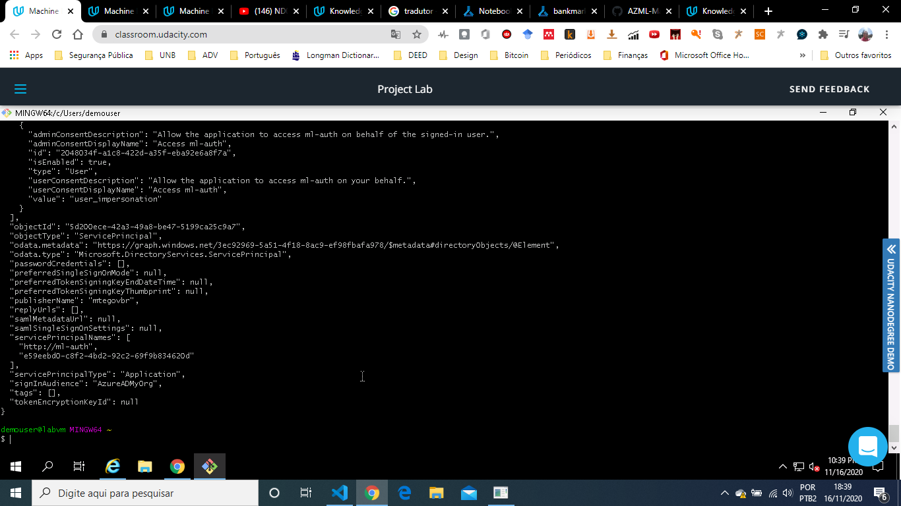

### Step 2: Automated ML Experiment
I uploaded bankmarketing_train.csv to Azure Machine Learning Studio so that it could be used during model training.
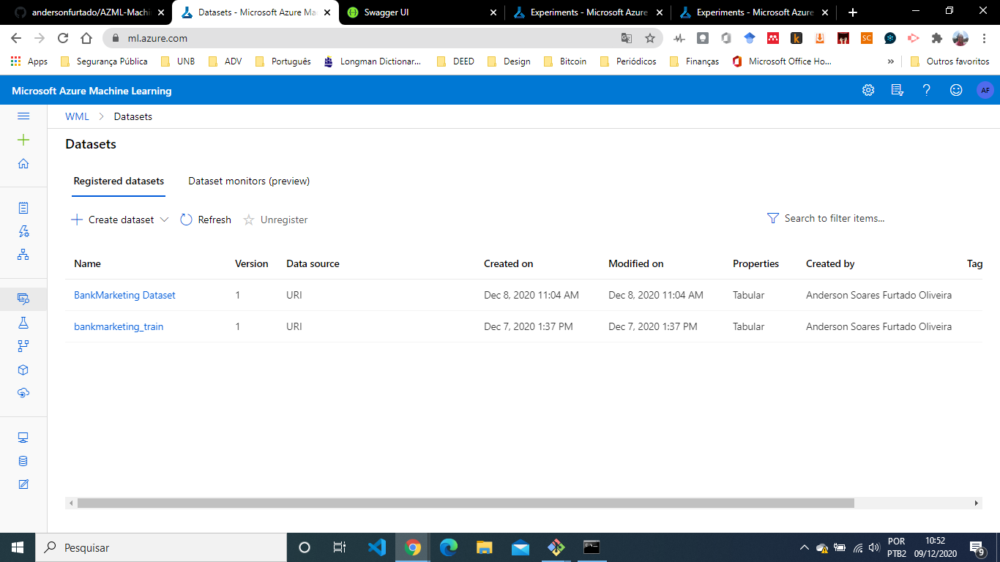

I ran the experiment using Classification.
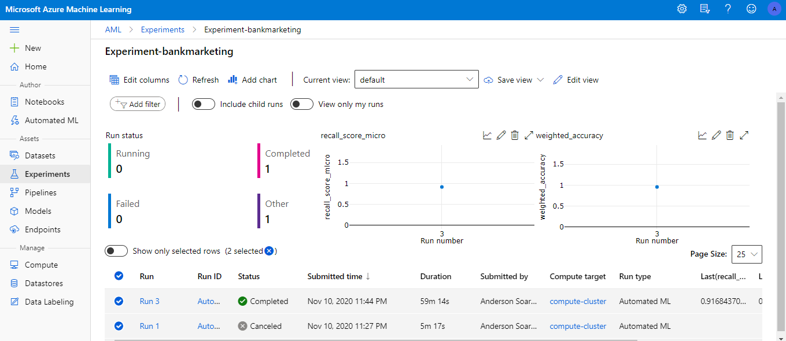

I identified the best model after the experiment completes.
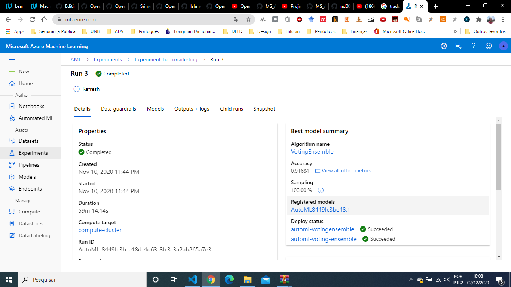

### Step 3: Deploy the best model
After completing the execution of the experiment, we implemented the best model allowing to interact with the HTTP API service and interact with the model, sending data through POST requests.
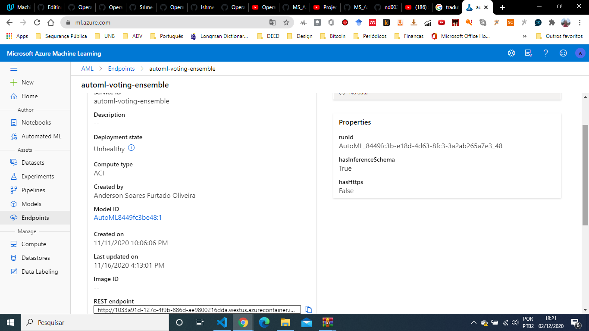

### Step 4: Enable logging
Usamos o código logs.py para visualizar os logs.
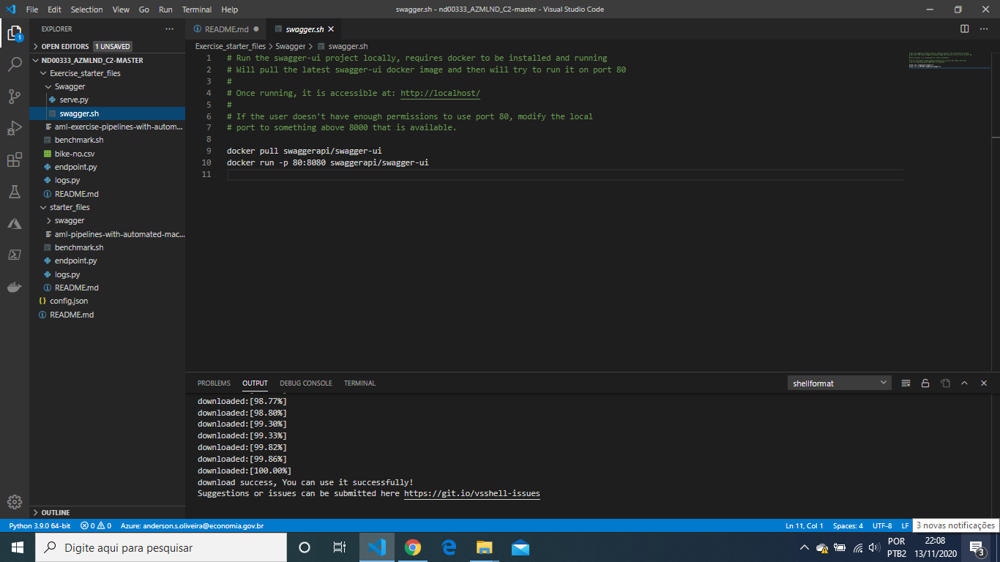

Application Insights has been enabled as we can see no endpoint tab.
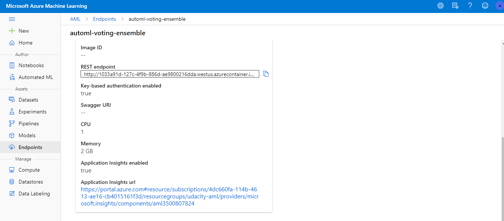

### Step 5: Swagger Documentation
We consume the implanted model using Swagger. We ran the swagger.sh and serve.py.
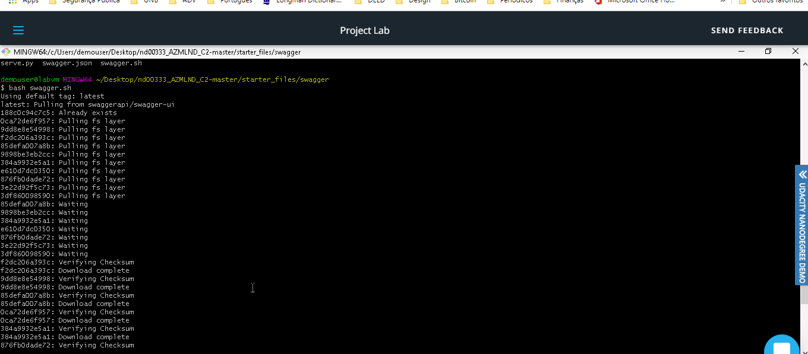

We interact with the swagger instance running with the documentation for the HTTP API of the automl-voting-ensemble model.

We display the contents of the API for the model.
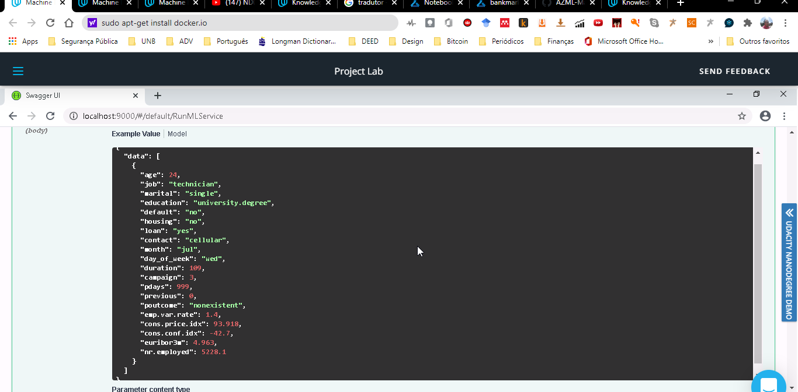

We interact with the Swagger.
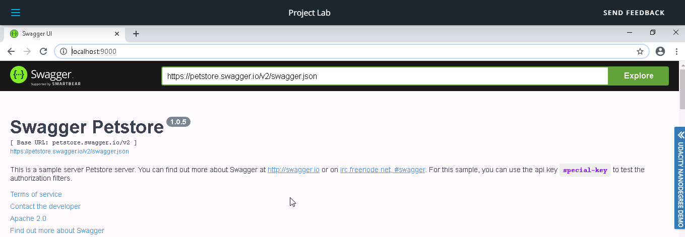

### Step 6: Consume model endpoints
The image below shows endpoint.py execution against the API, producing JSON output from the model.
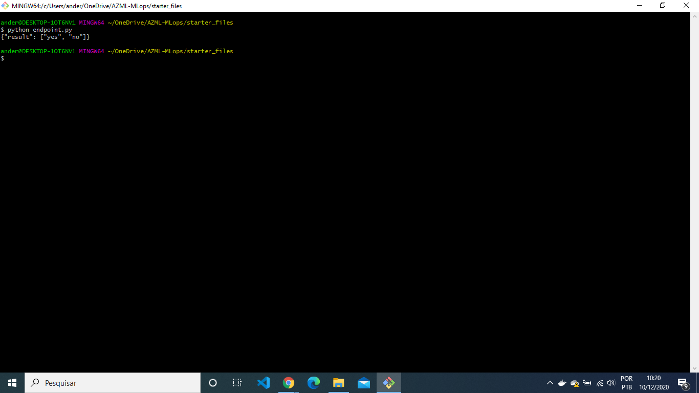

### Step 7: Create and publish a pipeline
The pipeline section of Azure ML studio, showing that the pipeline has been crated.
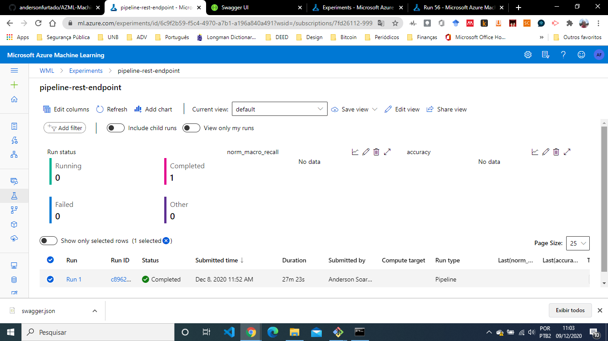

The "Published Pipeline overview", showing a REST endpoint and a status of "Active".
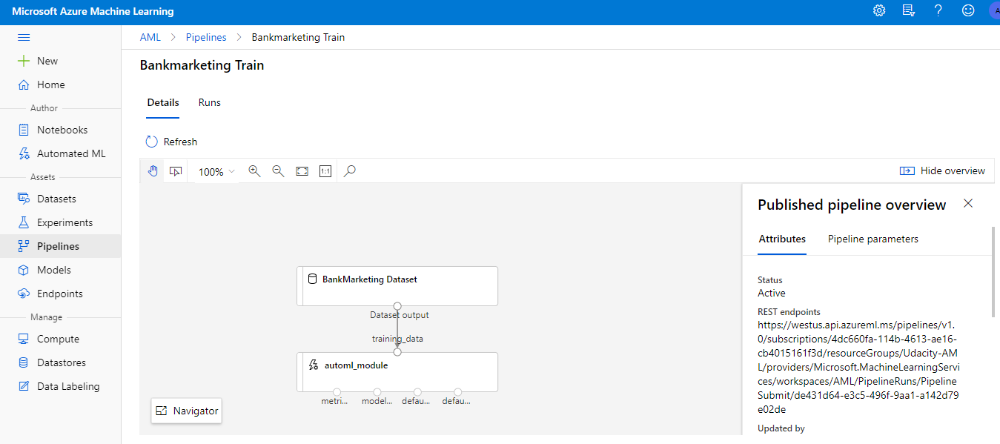

In Jupyter Notebook, showing that the "Use RunDetails Widget" sows the step runs.
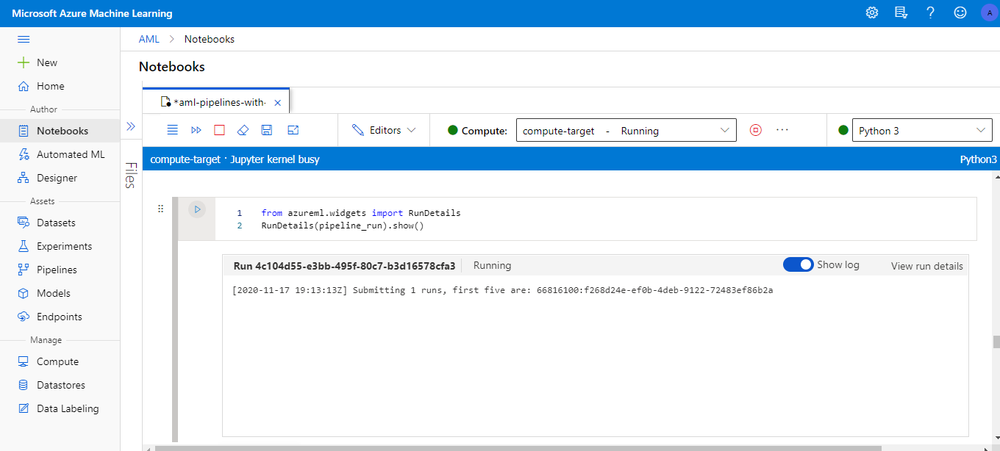

In ML studio showing the scheduled run
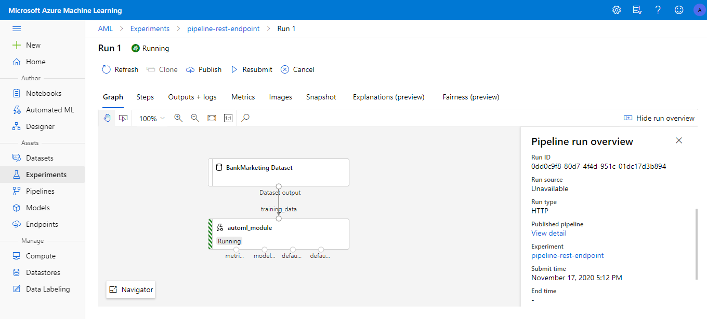

In ML studio showing the Pipeline endpoint and a status of "Active"
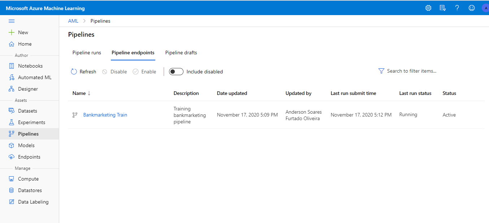

## Future Improvements
Some areas of improvement for future experiments are:
- Improve the performance of the algorithm by letting the model train for longer can lead to finding a better perofrming model.
- Improve accuracy by getting more samples and running AutoML again.

## Screencast Video
