# Operationalizing Machine Learning

Table of Contents
=================
  * [Overview](#Overview)
  * [Architecture](#Architecture)
  * [Project Steps](#project-steps)
  * [Future Improvements](#future-improvements)
  * [Screencast Video](#screencast-video)
  
## Overview

In this project, we used Microsoft Azure to demonstrate machine learning operations. This project used the Bank Marketing dataset. This dataset was used to create a classification model to predict whether the customer will sign a term deposit or not using the AutoML feature in Azure ML Studio. We used Azure to set up a cloud-based machine learning production model, deploy it and consume it. We also create, publish and consume a pipeline.

## Architecture
This image gives an overview of the architectural diagram of the project:
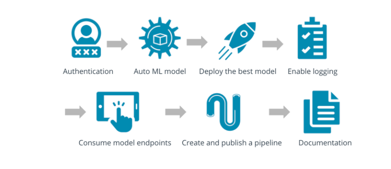

In this project, we follow the steps below:
- Authentication
- Automated ML Experiment
- Deploy the best model
- Enable logging
- Swagger Documentation
- Consume model endpoints
- Create and publish a pipeline

## Project Steps
We following the below steps:

### Step 1: Authentication

### Step 2: Automated ML Experiment
I uploaded bankmarketing_train.csv to Azure Machine Learning Studio so that it could be used during model training.

I ran the experiment using Classification.
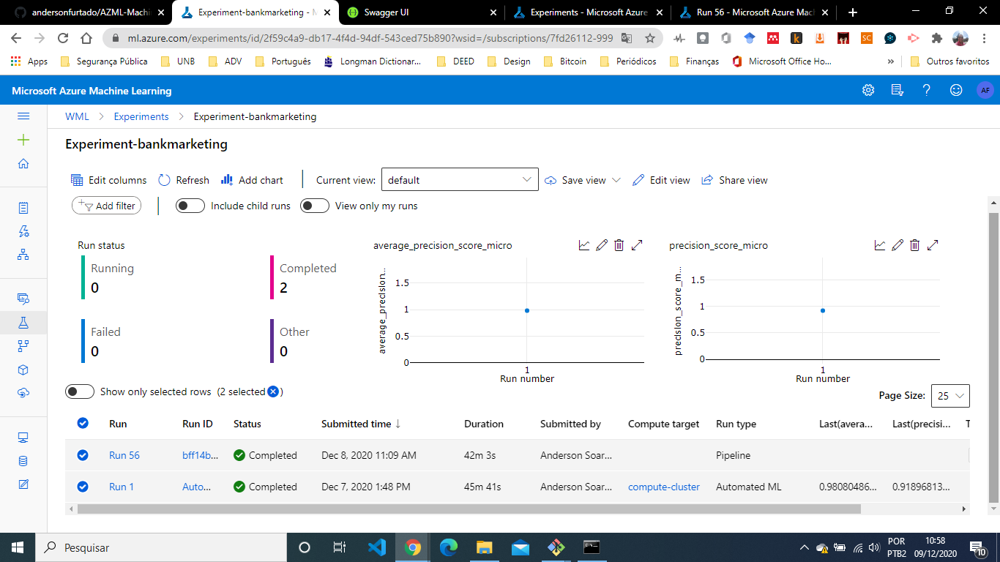

I identified the best model after the experiment completes.
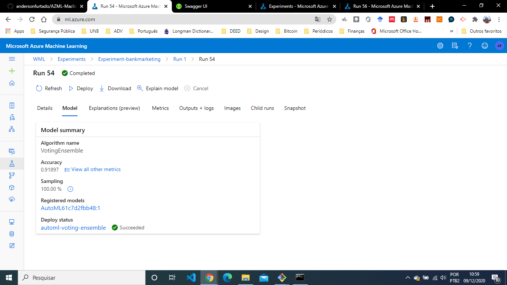

### Step 3: Deploy the best model
After completing the execution of the experiment, we implemented the best model allowing to interact with the HTTP API service and interact with the model, sending data through POST requests.
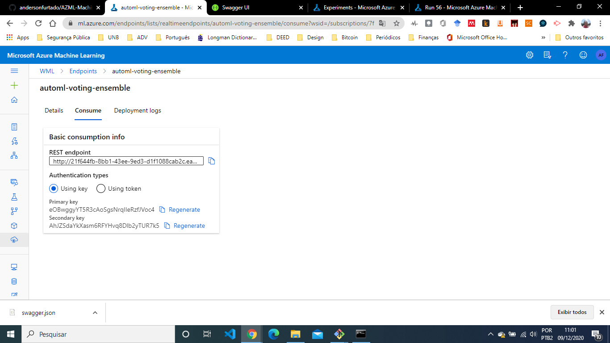

### Step 4: Enable logging

Usamos o código logs.py para visualizar os logs.
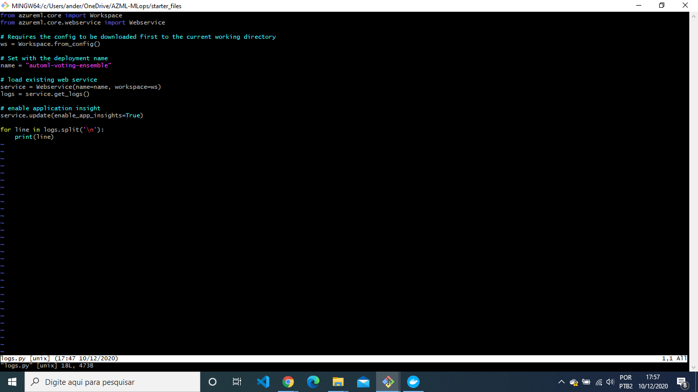

Showing that the logs.py script was ran.
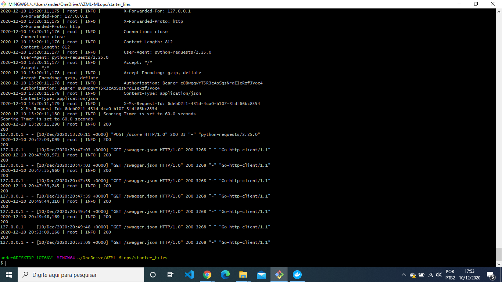

Application Insights has been enabled as we can see no endpoint tab.

### Step 5: Swagger Documentation
We consume the implanted model using Swagger. We ran the swagger.sh and serve.py.

We interact with the swagger instance running with the documentation for the HTTP API of the automl-voting-ensemble model.
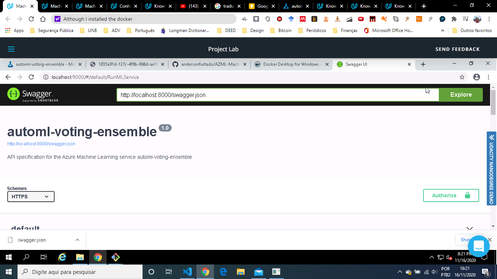

We display the contents of the API for the model.

We interact with the Swagger.

### Step 6: Consume model endpoints
The image below shows endpoint.py execution against the API, producing JSON output from the model.

### Step 7: Create and publish a pipeline
The pipeline section of Azure ML studio, showing that the pipeline has been crated.

The "Published Pipeline overview", showing a REST endpoint and a status of "Active".
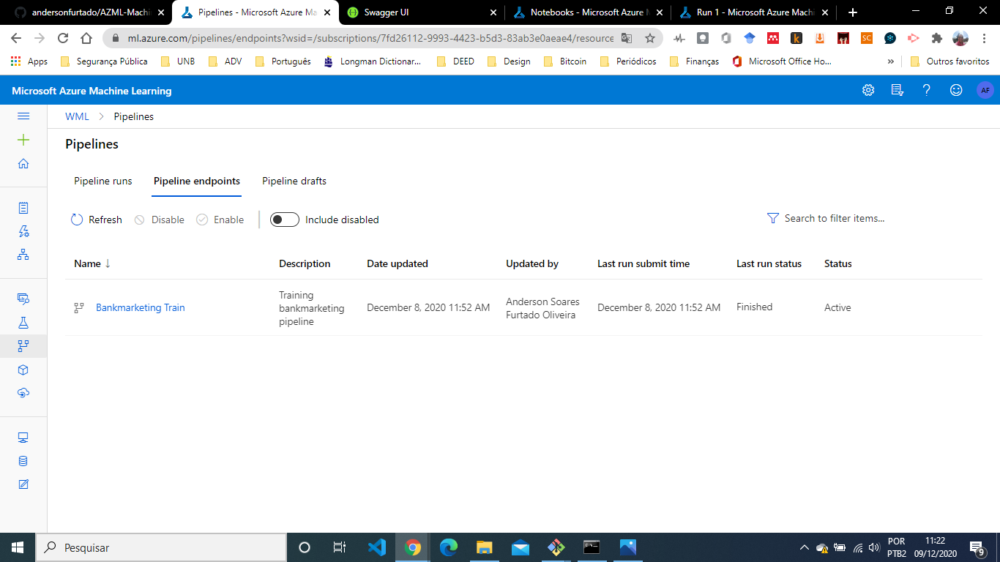

In Jupyter Notebook, showing that the "Use RunDetails Widget" sows the step runs.
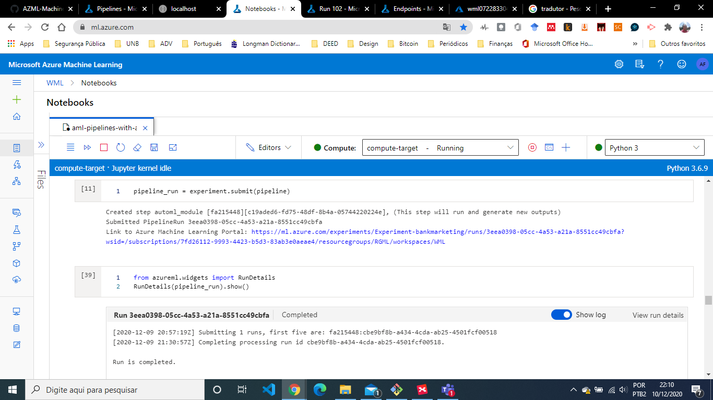

In ML studio showing the scheduled run
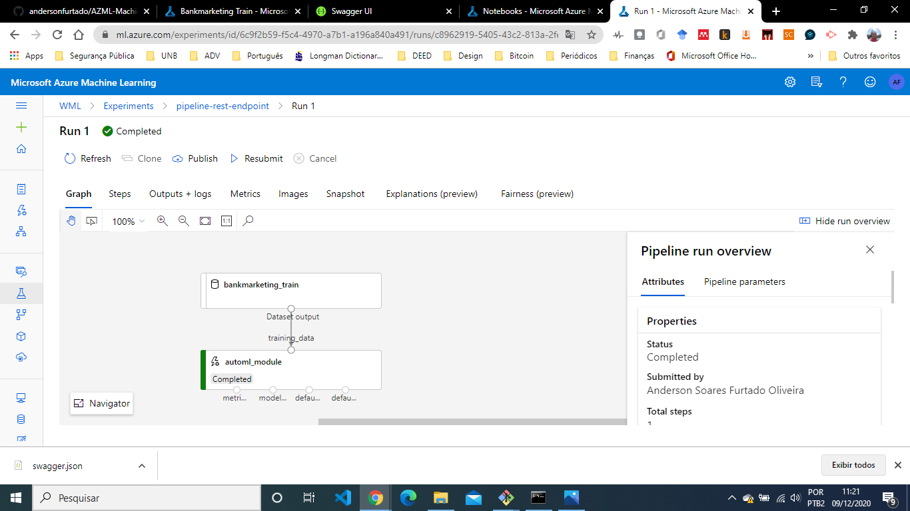

In ML studio showing the Pipeline endpoint and a status of "Active"
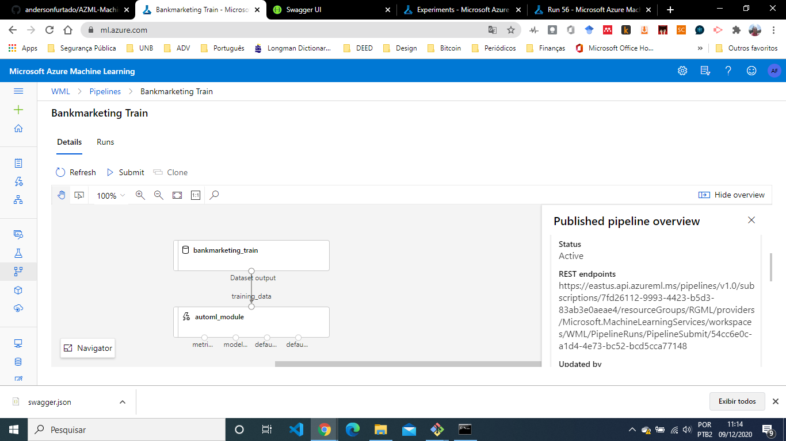

Pipeline section of Azure ML studio showing that the pipeline has been created
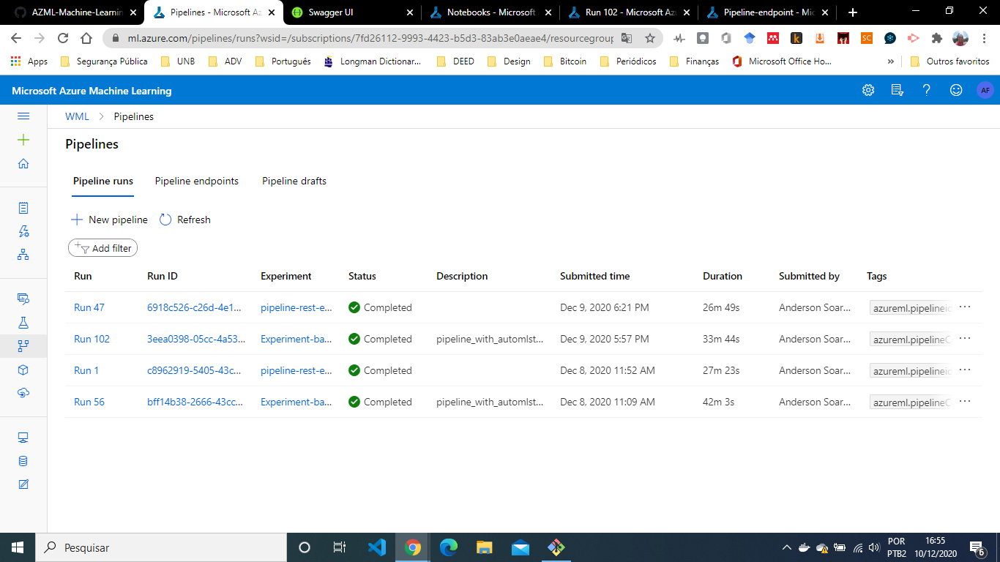

## Future Improvements
Some areas of improvement for future experiments are:
- _Getting more samples:_ There are several ways to improve the "accuracy" of a machine learning model, including: Treat missing and Outlier values, Feature Engineering (Feature transformation and Feature Creation), Feature Selection, Multiple algorithms, Algorithm Tuning, Ensemble methods (Bagging and Boosting) and Cross Validation, but in the present case we can highlight: (i) improve accuracy by getting more samples and running AutoML again, because if data is small and will miss complex patterns which can cause in poor performance in inference data; (ii) in order to increase the accuracy of the model, in the AutoML experiment we can enable the Deep Learning option in the Classification in order to allow the characterization of the text data. Sampling is a technique by which we pick and choose certain datapoints from the entire population to create a sample(subset of the entire population data). The algorithms of sampling the data are various but the point here is to fix the data imbalance issue we always need not increase the data which has less occurrence but decrease the datapoints which has more occurrence while maintaining the variance of the dataset.
- _More training time:_ Improve the performance of the algorithm by letting the model train for longer can lead to finding a better perofrming model, because when we give more time to learn, AutoML will try different hyperparameters that may be better than the previous one. Considering that there are inherent flaws in the data (class imbalance problem), more training time would not be necessary to improve performance.
- _Solving the class imbalance problem:_ The improvement of the accuracy could be when updating the data set to receive a more balanced one and increase the precision and robustness of the models. So the accuracy of the model can be improved by solving the class imbalance problem of the bank marketing data set, because the data has some inherent flaws. Increase the number of datapoints for the class which has less data (basically meaning to getting more data).
But this is not always the solution to fix the data imbalance issue and always in industrial projects the below written method is used because we cannot wait until new data is generated to create ML models.

## Screencast Video

https://youtu.be/KpkPo_rQloQ
